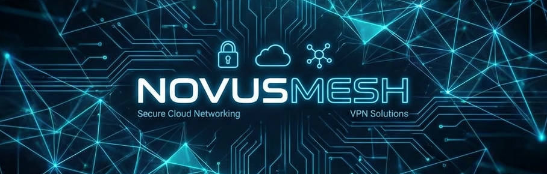
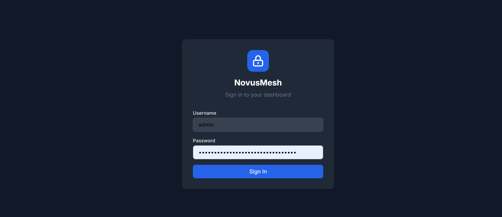
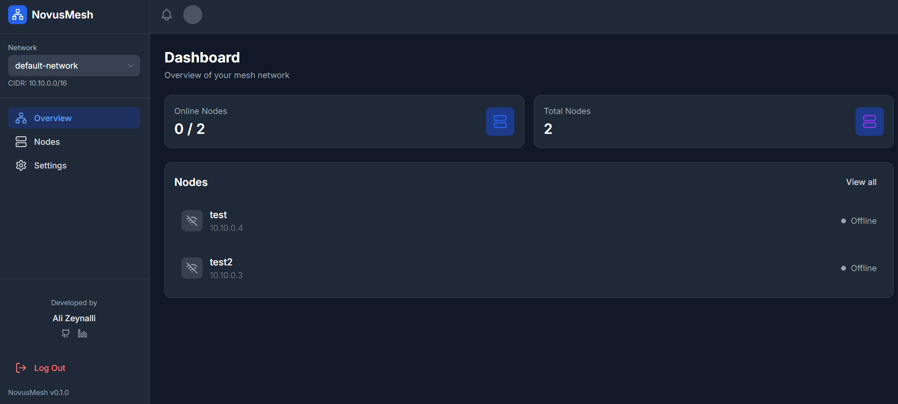
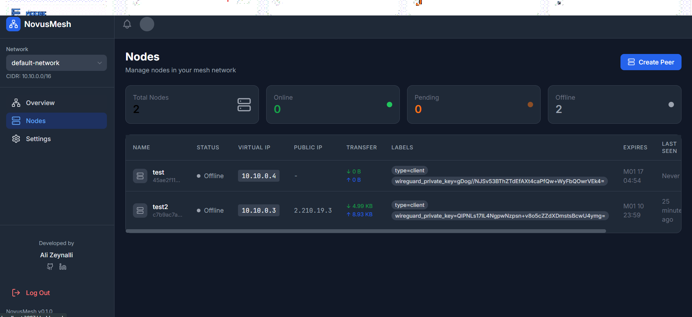
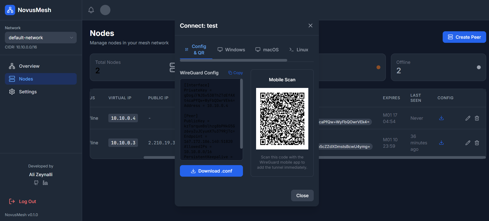
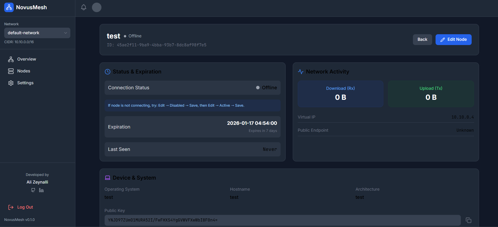
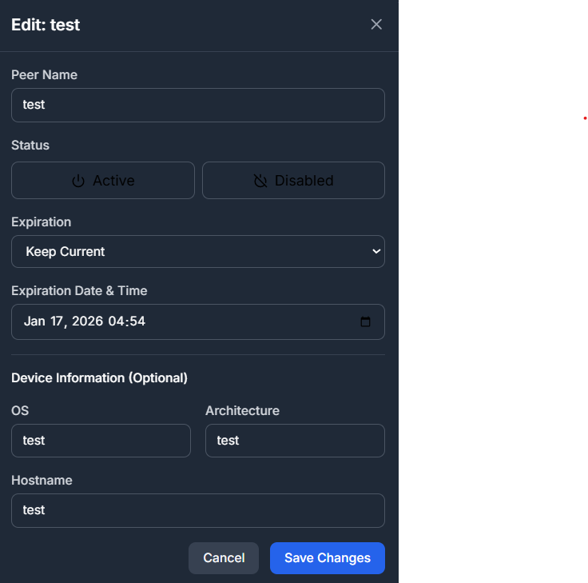
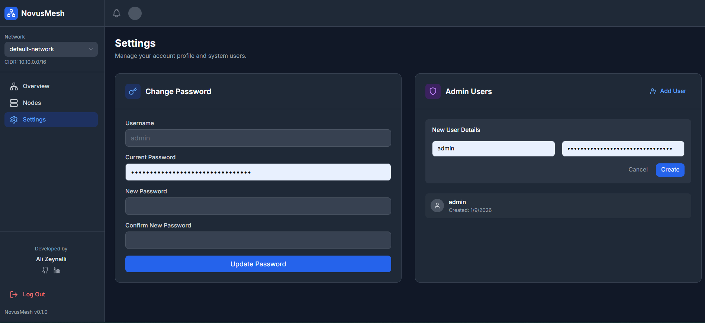
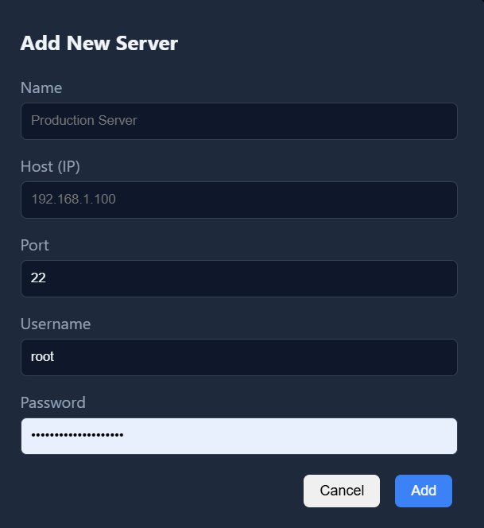
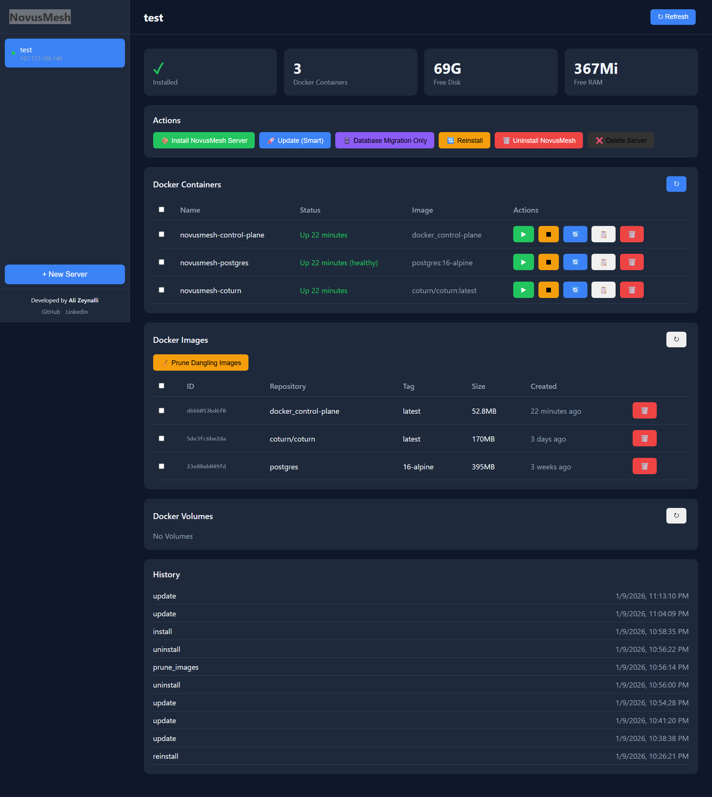

# NovusMesh

**NovusMesh** is a modern, secure, and self-hosted VPN solution built on top of the WireGuard® protocol. 

Designed for **System Administrators, Developers, DevOps Engineers, and everyday users**, it empowers you to create a private mesh network and **manage your devices securely from anywhere, at any time**. Whether you are managing a fleet of servers or just connecting your personal devices, NovusMesh makes it effortless.

 


## 🚀 Key Features

- **Hub-and-Spoke Mesh:** Centralized controller with direct peer-to-peer capabilities.
- **Modern Web Dashboard:** A beautiful React-based UI to manage your nodes and visualize network traffic.
- **One-Click Installer:** Easy deployment and updates via a dedicated installer tool.
- **Smart Updates:** Update your system without losing data or configurations.
- **Secure by Default:** Uses WireGuard's state-of-the-art cryptography, plus JWT and API keys for internal communication.
- **Localization:** Full support for English (default) and localization-ready architecture.

## 📂 System Architecture

The project is divided into three main components:

### 1. [Server (Backend)](./server)
The core logic written in **Go**. It manages the WireGuard interface, database (SQLite), and exposes the REST API.
- **Docs:** [Developer Guide](./server/DEVELOPER_GUIDE.md) | [User Guide](./server/USER_GUIDE.md)

### 2. [Web (frontend)](./web)
The administrative interface written in **React**, **TypeScript**, and **Tailwind CSS**.
- **Docs:** [Developer Guide](./web/DEVELOPER_GUIDE.md) | [User Guide](./web/USER_GUIDE.md)

### 3. [Installer](./installer)
A standalone Node.js tool to simplify deployment on Linux servers via SSH.
- **Docs:** [Developer Guide](./installer/DEVELOPER_GUIDE.md) | [User Guide](./installer/USER_GUIDE.md)

> 🇦🇿 **Azərbaycan Dilində:**
> Layihənin əsas sənədlərini Azərbaycan dilində oxumaq üçün **[README_AZ.md](./README_AZ.md)** faylına keçid edin.

## ⚡ Quick Start

### Prerequisites
- A Linux server (Ubuntu 20.04/22.04 recommended).
- Docker & Docker Compose installed on your local machine (for the installer).

### Installation via Installer
1. Navigate to the installer directory:
   ```bash
   cd installer
   ```
2. Start the installer interface:
   ```bash
   docker-compose up -d --build
   ```
3. Open your browser at `http://localhost:3000`.
4. Add your remote server credentials and click **Install NovusMesh Server**.

### Manual Installation
Refer to the [Server User Guide](./server/USER_GUIDE.md) for manual Docker deployment instructions.

## 🛡️ Security

- **Credentials:** The installer generates unique passwords and keys during setup. **Save them immediately.**
- **Ports:** Ensure UDP port `51820` is open on your server's firewall.
- **HTTPS:** For production use, we strongly recommend running the Web Dashboard behind a reverse proxy (Nginx/Caddy) with SSL.

## 📸 Screenshots

### Web Dashboard
<div style="display: flex; flex-wrap: wrap; gap: 10px;">
  
  
  
  
  
  
  
</div>

### Installer Interface
<div style="display: flex; flex-wrap: wrap; gap: 10px;">
  
  
</div>

## 🤝 Contributing

We welcome contributions! Please see the [Developer Guides](./server/DEVELOPER_GUIDE.md) for architecture details and code standards.

---

**Developed by [Ali Zeynalli](https://github.com/Ali7Zeynalli)**
*Project NovusMesh*
